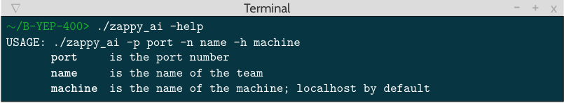

# Markdown Documentation AI

AI :robot: will be the the population of **Trantor**, called **Trantorians**

The AI :robot: of this project will be compose of one in multiple choices of **[Agent](#agent)**

## Summary

- **[Usage](#usage)**

- **[Definition](#definition)**

- **[Classes](#classes)**

  - **[Agent :alien:](#agent)**
  - **[Parameters :gear:](#parameters)**
  - **[Server :information_source:](#server)**

## Usage

## Definition

All the AI, no matter what Agent they have, will share these features/commands, here is the list of them:

| Action                       | Command              | Time Limit | Response                                       |
| ---------------------------- | -------------------- | ---------- | ---------------------------------------------- |
| Move up one tile             | **Forward**          | 7/*f*      | ok                                             |
| Turn 90° right               | **Right**            | 7/*f*      | ok                                             |
| Turn 90° left                | **Left**             | 7/*f*      | ok                                             |
| Look around                  | **Look**             | 7/*f*      | [tile1, tile2, ...]                            |
| Inventory                    | **Inventory**        | 1/*f*      | [linemate *n*, sibur *n*, ...]                 |
| Broadcast text               | **Broadcast *text*** | 7/*f*      | ok                                             |
| Number of team unused slots  | **Connect_nbr**      | -          | value                                          |
| Fork a player                | **Fork**             | 42/*f*     | ok                                             |
| Eject players from this tile | **Eject**            | 7/*f*      | ok/ko                                          |
| Death of a player            | -                    | -          | dead                                           |
| Take object                  | **Take *object***    | 7/*f*      | ok/ko                                          |
| Set object down              | **Set *object***     | 7/*f*      | ok/ko                                          |
| Start incantation            | **Incantation**      | 300/*f*    | Elevation underway   Current level: k / ko |

## Classes

- ### Agent

  - **Description**

    This class manage the type and the nature of the AI :robot:, which will decide how they would act on the map.   This class contain all common function to all Agents.

     

  - **List**

    | Name               | Description                                                                            |
    | ------------------ | -------------------------------------------------------------------------------------- |
    | Trantorian :alien: | Live a life of a basic *Trantorian* without particularities.                           |
    | Répétoile :star:   | Repeat of other team to block the communications to other *Trantorians*.               |

     

  - **Attributes**

        self.inventory -> dictionnary that contains all the inventory of the *Trantorian*
        self.server -> server object
        self.isDead -> boolean to see if the *Trantorian* is dead
        self.inventory -> list of all the materials that the *Trantorian* have
        self.vision -> list with all the tiles that he can see
        self.level -> the level of the *Trantorian*
        self.moveStack -> stack with all the moves actions
        self.broadcastStack -> stack with all the broadcast to do
        self.__levelRequirements -> list of requirements with level keys

     
  
  - **Functions**

        def askServer(self, server: Server, msg: str)
        // ask a command to the server by the message
        
        def fillInventory(self, server: Server)
        // fill the *self.inventory* variable with the "Inventory" command

        def fillVisions(self, server: Server)
        // fill the *self.vision* variable with the "Look" command

        def __getYtoGo(self, listIndex: int)
        // return the number of time to forward to be on the same row as listIndex

        def __getXandDirectionToGo(self, listIndex: int)
        // return the number of time to forward to be on the same column as listIndex

        def fillMoveStack(self, listIndex: int)
        // fill the moveStack of the agent to go to the index of the vision list

        def distanceTo(self, listIndex: int)
        // returns the distance to the index of the vision list

        def __verifyVision(self, server: Server, needed: dict)
        // verify if the vision of the agent contains the needed resources

        def canElevate(self, server: Server)
        // return true if the agent can level up

        def live(self, server: Server)
        // function that would be redefined by child classes, defined what he is going to do all along his life

        def birth(self, server: Server)
        // function that would be redefined by child classes, launched at the birth of the agent, like an init

        def run(self, server: Server)
        // do all the function that define his type

        def __treatMessage(self, message : str)
        // Treats the message received from the server to avoid getting the wrong response.

        def __getRealResponse(self, message: str):
        // Returns the real message from the server removing useless mesage like broadcast or death.

        def __bufferManager(self, message: str):
        // Get the real message even if the server send it with misplace /n.

  
     

  - **Types**

     

    - :star: **Répétoile :star:**

       

      - **Attributes**

            self.teamName -> keep the team name of the *Trantorian*
            self.state -> state of the *Trantorian*

      - **Functions**

            def birth(self, server: Server) *function override*
            // init the *Trantorian* at his birth

            def live(self, server: Server) *function override*
            // do all the action that are necessary to live

            def repeat(self, server: Server)
            // use to repeat a broadcast in loop to block the communication

            def searchObject(self, server: Server, object: str)
            // search an object on the tile that he can see

     

    - **🧱 Basic 🧱**

     

    - **Attributes**

            self.teamName -> keep the team name of the *Trantorian*
            self.state -> state of the *Trantorian*

      - **Functions**

            def birth(self, server: Server) *function override*
            // init the *Trantorian* at his birth

            def live(self, server: Server) *function override*
            // do all the action that are necessary to live

            def repeat(self, server: Server)
            // use to repeat a broadcast in loop to block the communication

            def searchObject(self, server: Server, object: str)
            // search an object on the tile that he can see

 

- ### Parameters
  
  - **Description**
  
    This class manage if the parameters are in the good type and if there is no problem to launch the program.

     

  - **Attributes**
  
        self.port -> the port use to communicate with the server
        self.host -> the ip address use to host to communicate with the server
        self.name -> the name of the team

     

- ### Server

  - **Description**

    This class manage to send *messages / actions / commands* to the server and get the response from him.

     

  - **Attributes**

        self.ip -> the ip address of the server
        self.port -> the port of the server
        self.socket -> the socket of the client

  - **Functions**

        def connect(self)
        // connect to the server with creating a socket

        def printResponse(self)
        // get and print the response from the server

        def getResponse(self)
        // get the response from the server

     
